# 需求分析与系统设计 - 需求分析

## 一、任务概述
### （一）任务目标

本项目旨在设计并实现一个英语六级考试报考系统，提供完整的报名、缴费、考试、阅卷、查询等功能，方便考生、教师和考试管理人员的操作，提高考试效率和管理水平。

### （二）用户特点

本系统的用户分为三类：考生、教师、考试管理人员。考生用户需要报名考试、进行线上考试、查询考试结果等；教师用户需要管理考试、题库、试卷等；考试管理人员需要对考试科目、试卷类型、教师、学生进行管理。

### （三）假定与约束

1. 假定用户已具备基本的计算机操作知识和英语六级考试相关知识。
2. 假定该用户使用的是主流的能支持 JDK 1.8 的操作系统
3. 假定该运行该系统的环境支持 Mysql 数据库。
4. 假定考试场次、考试时间、考试费用等信息已经确定。
5. 假定运行使用该系统的用户能保证网络畅通和稳定性。
6. 系统应该能够保证考试信息和成绩的安全性和可靠性。
7. 系统采用web应用实现，需要网络连接和浏览器支持。

## 二、业务描述
### （一）系统总业务流程图及其描述

系统总业务流程图如上所示，用户进入登陆界面后，根据不同的用户身份进入对应的页面。

### （二）各个子业务流程图及其描述
#### 1. 考试管理人员页面流程图：

考试管理人员页面流程图如上所示，管理员可以对考试科目、试卷类型、教师、学生进行管理。

#### 2. 教师页面流程图

教师页面流程图如上所示，教师可以对考试、题库、试卷进行管理。

#### 3. 考生页面流程图

考生页面流程图如上所示，考生可以报名考试、进行线上考试、查询考试结果等。

## 三、数据需求
### （一）数据需求描述

系统需要存储用户信息、考试科目、试卷类型、教师、学生、考试、试题等数据。

### （二）数据流图
#### 1. 顶层数据流图

顶层数据流图如上所示，包括管理员、教师和考生三个子系统，管理员可以管理整个系统，教师可以管理考试、题库和试卷，考生可以报名参加考试、进行线上考试、查询考试结果等。

#### 2. 0层数据流图

将顶层数据流图中的系统分解为7个子系统，如上图所示。下面给出其中较为复杂的4个子系统的1层数据流图。

#### 3. 1层数据流图
##### 3.1 处理报名情况

考生在提交报名信息和缴费记录后，负责处理报名情况的子系统首先会根据考生信息，检查其是否符合报名条件；随后检查其缴费情况是否属实，缴费金额是否正确，若通过判断，则在报名记录表中写入考生的报名情况。

##### 3.2 发送考试试卷

在考生请求在线考试，需要获取试卷内容时，负责发送考试试卷的子系统首先会从存储的报名记录中查找考生的报考科目；若查询到的科目和考生当前请求的试卷科目吻合，则利用对应试卷的编号在试卷记录中找到试卷内容，并将试卷内容发送给考生。

##### 3.3 处理考试作答

在考生向系统提交作答情况后，负责处理考试作答的子系统首先会将考生的选择题答题情况和作文答题情况记录在作答记录中；随后子系统从试卷记录中获取选择题的答案，根据作答记录中考生的选择题作答计算选择题得分，并将得分记录。

##### 3.4 处理成绩查询

在考生向系统提交成绩查询请求后，负责处理成绩查询的子系统首先会从报名记录中查询该考生的报名情况；若该考生确实参加了该考试，则从成绩记录中读取该考生的选择题得分和作文得分，将两者相加得到总成绩后发送考生。

### （三）数据字典

|实体|属性|属性描述|
|---|---|---|
|用户|用户名|用户的账号名|
||密码|用户的账号密码|
||用户类型|用户的身份类型，包括考生、教师、考试管理人员|
|考试科目|科目名称|考试科目的名称|
|试卷类型|类型名称|试卷类型的名称|
|教师|工号|教师的工号|
||密码|教师的账号密码|
||姓名|教师的姓名|
|学生|学号|学生的学号|
||姓名|学生的姓名|
||密码|学生的账号密码|
||所考试卷类型|学生所参加考试的试卷类型|
|考试|试卷名称|考试所使用的试卷的名称|
||试卷类型|考试所使用的试卷的类型|
||命题人|考试的命题人|
||考试科目|考试的科目|
||考试试题及对应分值|考试的试题及其对应的分值|
||考试开始时间|考试的开始时间|
||考试结束时间|考试的结束时间|
||考试时间|考试的总时间|
|试题|题目|试题的题目|
||选项|试题的选项|
||答案|试题的答案|
||分值|试题的分值|
||类型|试题的类型，包括选择题和作文题|

## 四、功能需求

### （一）功能划分

本系统的功能分为三类：考试管理人员功能、教师功能、考生功能。

### （二）功能描述
#### 1. 考试管理人员能使用的功能
1. 查看现有考试科目
2. 增加考试科目
3. 删除考试科目
4. 修改考试科目的属性
5. 查看现有试卷类型
6. 增加试卷类型
7. 删除试卷类型
8. 修改试卷类型的属性
9. 查看现有教师
10. 增加教师
11. 删除教师
12. 修改教师的属性
13. 查看现有考生信息
14. 增加考生
15. 删除考生
16. 修改考生的属性

#### 2. 教师能使用的功能
1. 查看现有考试信息
2. 增加考试
3. 删除考试
4. 修改考试的属性
5. 查看现有题库信息
6. 增加试题
7. 删除试题
8. 修改试题的属性
9. 查看现有试卷信息
10. 增加试卷
11. 删除试卷
12. 修改试卷的属性

#### 3. 考生能使用的功能
1. 报名参加考试
2. 查看已报名的考试信息
3. 进行线上考试
4. 查询考试结果
5. 修改用户密码

## 五、非功能需求
### （一）性能需求
1. 系统应能够支持大量用户同时在线。
2. 系统应能够快速响应用户的请求，保证用户体验。
3. 系统应能够在高并发情况下保持稳定。
### （二）可用性需求
1. 系统应具有良好的用户界面设计，方便用户使用。
2. 系统应具有良好的用户反馈机制，及时处理用户反馈。
### （三）安全性需求
1. 系统应能够保证考试数据的安全性，防止数据泄露。
2. 系统应能够保证考试过程的公平性，防止作弊行为。
3. 系统应能够保证用户密码的安全性，防止密码泄露。
### （四）可维护性需求
1. 系统应具有良好的代码结构，方便维护和扩展。
2. 系统应具有良好的文档说明，方便后期维护和升级。
### （五）可移植性需求
1. 系统应具有良好的可移植性，能够在不同的操作系统和平台上运行。
2. 系统应具有良好的兼容性，能够兼容不同的浏览器和设备。

## 六、系统运行要求
### （一）硬件配置要求
1. CPU：双核及以上，频率不低于 2.0 GHz
2. 内存：4GB及以上。
3. 存储：100GB及以上。
4. 需要稳定的网络连接，且网络带宽不低于 10Mbps，网络延迟不超过 1000ms
### （二）软件配置要求
1. 操作系统：Windows、Linux、MacOS 等支持Java的主流操作系统均可。
2. JDK：需要安装 JDK1.8 及以上版本。
3. 数据库：需要安装 MySQL5.7 及以上版本，并使用 Navicat 等数据库管理工具进行管理。
4. 浏览器：需要使用 Google Chrome 浏览器进行测试和使用。